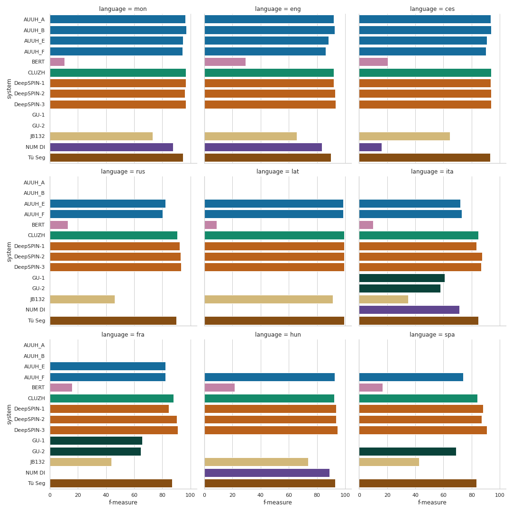
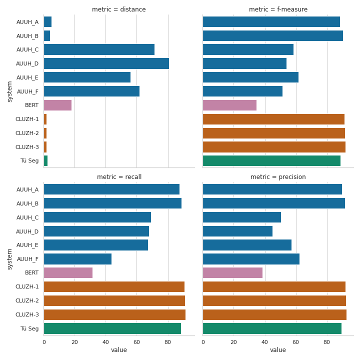
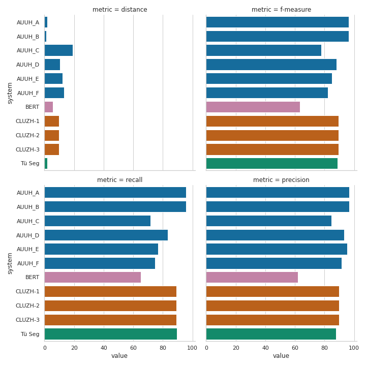
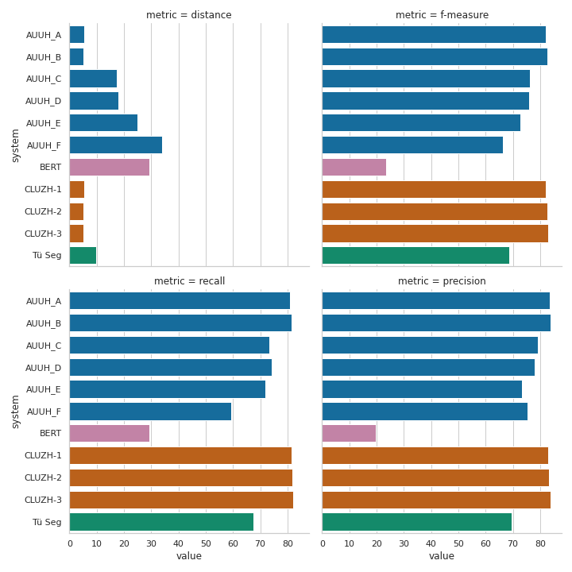

# Preliminary results

Please report or open issue if you find any errors from the numbers below. Also it is not final results, and we are still working on completing morphological categories results on the word-level task. 

## Team details

| # | Name     | Authors                                                                      | University Affiliation(s)                                  |
|---|----------|------------------------------------------------------------------------------|------------------------------------------------------------|
| 1 | AUUH     | Aku Rouhe, Stig-Arne Grönroos,   Sami Virpioja, Mathias Creutz, Mikko Kurimo | Aalto University  / University of Helsinki                 |
| 2 | CLUZH    | Silvan Wehrli, Simon Clematide, Peter Makarov                                | University of Zurich                                       |
| 3 | DeepSPIN | Ben Peters, André Martins                                                    | Instituto de Telecomunicações / Instituto Superior Técnico |
| 4 | GU       | Lauren Levine                                                                | Georgetown University                                      |
| 5 | JB132    | Jan Bodnár                                                                   | Charles University                                         |
| 6 | NUM DI   | Tsolmon Zundui, Chinbat Avaajargal                                           | National University of Mongolia                            |
| 7 | Tü Seg   | Leander Girrbach                                                             | University of Tübingen                                     |

## Part1: Word-level task results
This table reports the f-measure performances of all submitted systems.
|   System   |  ces  |  eng  |  fra  |  ita  |  lat  |  rus  |  mon  |  hun  |  spa  | macro avg. |
|:----------:|:-----:|:-----:|:-----:|:-----:|:-----:|:-----:|:-----:|:-----:|:-----:|:----------:|
| AUUH_A     | 93.65 | 92.32 |     - |     - |     - |     - | 98.19 |     - |     - |      94.72 |
| AUUH_B     | 93.85 | 93.20 |     - |     - |     - |     - | 98.31 |     - |     - |      95.12 |
| AUUH_E     | 90.71 | 87.10 | 90.78 | 92.39 | 98.71 | 94.33 | 96.06 |     - |     - |      92.87 |
| AUUH_F     | 90.28 | 86.40 | 90.81 | 92.56 | 98.85 | 93.68 | 95.32 | 98.34 | 97.25 |      93.72 |
| WordPiece  | 20.42 | 23.06 | 12.66 |  9.08 |  8.84 | 13.81 | 14.58 | 24.00 | 16.57 |      15.89 |
| ULM        | 23.71 | 32.32 | 16.08 | 10.65 | 10.42 | 15.67 | 25.82 | 31.27 | 19.58 |      20.61 |
| Morfessor2 | 29.43 | 37.65 | 22.38 | 9.02  | 14.53 | 17.71 | 37.80 | 40.96 | 20.64 |      25.57 |
| CLUZH      | 93.81 | 92.70 | 94.80 | 96.93 | 99.37 | 98.62 | 98.12 | 98.54 | 98.74 |      **96.85** |
| DeepSPIN-1 | 93.42 | 92.29 | 91.66 | 96.01 | 99.37 | 98.75 | 98.03 | 98.56 | 98.79 |      96.32 |
| DeepSPIN-2 | **93.88** | 93.39 | 95.29 | **97.47** | 99.36 | 99.30 | 98.00 | 98.68 | 99.02 |      97.15 |
| DeepSPIN-3 | 93.84 | **93.63** | **95.73** | 97.43 | **99.38** | **99.35** | **98.51** | **98.72** | **99.04** |      **97.29** |
| GU-1       |     - |     - | 83.44 | 88.69 |     - |     - |     - |     - |     - |      86.07 |
| GU-2       |     - |     - | 83.38 | 87.49 |     - |     - |     - |     - | 95.95 |      88.94 |
| JB132      | 64.65 | 65.43 | 46.20 | 33.44 | 91.39 | 50.55 | 57.82 | 72.64 | 43.39 |      58.39 |
| NUM DI     | 16.15 | 83.56 |     - | 89.55 |     - |     - | 85.59 | 95.91 |     - |      74.15 |
| Tü Seg     | 93.38 | 90.51 | 93.76 | 95.73 | 99.37 | 98.21 | 97.02 | 98.59 | 97.93 |      **96.06** |

### Morphological categories' results in word-level subtask

| category | infl. | deri. | comp. | system     |       eng |        fra |        ita |        rus |       mon |       hun |       spa | macro avg. |
|----------|-------|-------|-------|------------|----------:|-----------:|-----------:|-----------:|----------:|----------:|----------:|-----------:|
| 000      | no    | no    | no    | AUUH_A     |     80.39 |          - |          - |          - |     87.16 |         - |         - |          - |
| 000      | no    | no    | no    | AUUH_B     |     83.51 |          - |          - |          - |     90.09 |         - |         - |          - |
| 000      | no    | no    | no    | AUUH_E     |     76.34 |      65.96 |      63.35 |      63.38 |     83.78 |         - |         - |          - |
| 000      | no    | no    | no    | AUUH_F     |     72.59 |      66.32 |      64.34 |      59.85 |     87.76 |     81.41 |     63.69 |      70.85 |
| 000      | no    | no    | no    | BERT       |      3.68 |       8.90 |       4.70 |      11.55 |      2.55 |      9.61 |      9.35 |       7.19 |
| 000      | no    | no    | no    | CLUZH      | **83.80** |      81.70 |      79.66 |      68.83 |     88.36 |     77.12 |     80.77 |      80.03 |
| 000      | no    | no    | no    | DeepSPIN-1 |     83.10 |      67.77 |      77.44 |  **82.56** |     89.22 |     82.64 |     81.33 |      80.58 |
| 000      | no    | no    | no    | DeepSPIN-2 |     83.01 |      82.42 |  **82.69** |      82.35 |     85.55 |     80.90 | **83.58** |      82.93 |
| 000      | no    | no    | no    | DeepSPIN-3 |     83.45 |  **84.08** |      80.32 |      81.40 |     87.91 | **85.52** |     82.54 |  **83.60** |
| 000      | no    | no    | no    | GU-1       |         - |      57.25 |      50.25 |          - |         - |         - |         - |          - |
| 000      | no    | no    | no    | GU-2       |         - |      44.60 |      47.12 |          - |         - |         - |     51.41 |          - |
| 000      | no    | no    | no    | JB132      |     29.59 |      65.30 |      43.90 |      76.73 | **93.37** |     81.41 |     65.27 |      65.08 |
| 000      | no    | no    | no    | NUM DI     |     73.09 |          - |      60.24 |          - |     86.05 |     74.03 |         - |          - |
| 000      | no    | no    | no    | Tü Seg     |     79.99 |      77.11 |      73.72 |      68.17 |     81.05 |     79.34 |     74.54 |      76.27 |

| category | infl. | deri. | comp. | system     |       eng |        fra |        ita |        rus |       mon |       hun |       spa | macro avg. |
|----------|-------|-------|-------|------------|----------:|-----------:|-----------:|-----------:|----------:|----------:|----------:|-----------:|
| 001      | no    | no    | yes   | AUUH_A     | **93.23** |          - |          - |          - |    100.00 |         - |         - |          - |
| 001      | no    | no    | yes   | AUUH_B     |     92.88 |          - |          - |          - |    100.00 |         - |         - |          - |
| 001      | no    | no    | yes   | AUUH_E     |     90.85 |      74.40 |      39.53 |      65.35 |    100.00 |         - |         - |          - |
| 001      | no    | no    | yes   | AUUH_F     |     89.61 |      78.01 |      41.38 |      57.73 |    100.00 |     80.09 |     14.95 |      65.97 |
| 001      | no    | no    | yes   | BERT       |     53.06 |      42.18 |      12.69 |      17.18 |      0.00 |     16.35 |     16.46 |      22.56 |
| 001      | no    | no    | yes   | CLUZH      |     91.95 |  **81.80** |  **58.10** |      72.38 |    100.00 |     79.64 |     41.51 |      75.05 |
| 001      | no    | no    | yes   | DeepSPIN-1 |     93.09 |      78.81 |      51.14 |      75.00 |    100.00 |     84.08 |     51.38 |      76.21 |
| 001      | no    | no    | yes   | DeepSPIN-2 |     92.54 |      79.51 |      57.63 |  **77.67** |    100.00 |     84.26 |     42.86 |      76.35 |
| 001      | no    | no    | yes   | DeepSPIN-3 |     92.74 |      80.84 |      56.67 |      76.19 |    100.00 | **85.89** | **57.89** |  **78.60** |
| 001      | no    | no    | yes   | GU-1       |         - |      27.67 |      18.37 |          - |         - |         - |         - |          - |
| 001      | no    | no    | yes   | GU-2       |         - |      35.01 |      23.16 |          - |         - |         - |     13.45 |          - |
| 001      | no    | no    | yes   | JB132      |     77.98 |      40.52 |      55.56 |      44.90 |    100.00 |     80.77 |     42.65 |      63.20 |
| 001      | no    | no    | yes   | NUM DI     |     87.94 |          - |      32.77 |          - |    100.00 |     75.01 |         - |          - |
| 001      | no    | no    | yes   | Tü Seg     |     90.40 |      79.59 |      56.35 |      73.58 |    100.00 |     81.13 |     45.22 |      75.18 |

| category | infl. | deri. | comp. | system     |       eng |        fra |        ita |        rus |       mon |       hun |       spa | macro avg. |
|----------|-------|-------|-------|------------|----------:|-----------:|-----------:|-----------:|----------:|----------:|----------:|-----------:|
| 010      | no    | yes   | no    | AUUH_A     |     93.35 |          - |          - |          - |     91.39 |         - |         - |          - |
| 010      | no    | yes   | no    | AUUH_B     |     93.75 |          - |          - |          - |     91.44 |         - |         - |          - |
| 010      | no    | yes   | no    | AUUH_E     |     87.56 |      78.88 |      84.11 |      80.88 |     87.63 |         - |         - |          - |
| 010      | no    | yes   | no    | AUUH_F     |     87.07 |      78.43 |      84.75 |      80.96 |     84.02 |     92.62 |     75.87 |      83.39 |
| 010      | no    | yes   | no    | BERT       |     27.22 |      15.70 |      16.10 |      17.81 |     14.19 |     25.12 |     17.86 |      19.14 |
| 010      | no    | yes   | no    | CLUZH      |     92.60 |      84.71 |      92.97 |      88.23 |     90.77 |     93.46 |     88.51 |      90.18 |
| 010      | no    | yes   | no    | DeepSPIN-1 |     92.67 |      82.05 |      92.17 |      88.17 |     89.99 |     94.30 |     90.84 |      90.03 |
| 010      | no    | yes   | no    | DeepSPIN-2 |     94.02 |      86.43 |      94.26 |      90.81 |     91.05 |     94.91 |     91.33 |      91.83 |
| 010      | no    | yes   | no    | DeepSPIN-3 | **94.12** |  **87.36** |  **94.62** |  **91.40** | **92.41** | **94.96** | **92.47** |  **92.48** |
| 010      | no    | yes   | no    | GU-1       |         - |      62.39 |      73.90 |          - |         - |         - |         - |          - |
| 010      | no    | yes   | no    | GU-2       |         - |      63.79 |      71.96 |          - |         - |         - |     67.13 |          - |
| 010      | no    | yes   | no    | JB132      |     70.52 |      51.50 |      45.06 |      48.40 |     45.86 |     74.01 |     36.15 |      53.07 |
| 010      | no    | yes   | no    | NUM DI     |     82.87 |          - |      81.61 |          - |     71.06 |     88.60 |         - |          - |
| 010      | no    | yes   | no    | Tü Seg     |     90.73 |      82.50 |      90.86 |      86.74 |     88.15 |     94.21 |     88.12 |      88.76 |

| category | infl. | deri. | comp. | system     |       eng |        fra |        ita |        rus |       mon |       hun |       spa | macro avg. |
|----------|-------|-------|-------|------------|----------:|-----------:|-----------:|-----------:|----------:|----------:|----------:|-----------:|
| 011      | no    | yes   | yes   | AUUH_A     |     95.60 |          - |          - |          - |         - |         - |         - |          - |
| 011      | no    | yes   | yes   | AUUH_B     |     94.53 |          - |          - |          - |         - |         - |         - |          - |
| 011      | no    | yes   | yes   | AUUH_E     |     92.50 |      76.60 |      50.67 |      83.33 |         - |         - |         - |          - |
| 011      | no    | yes   | yes   | AUUH_F     |     90.79 |      73.43 |      54.55 |      78.48 |         - |     85.55 |     43.75 |      71.09 |
| 011      | no    | yes   | yes   | BERT       |     36.93 |      15.72 |       9.71 |      12.46 |         - |     23.06 |     19.51 |      19.57 |
| 011      | no    | yes   | yes   | CLUZH      |     94.29 |      68.59 |      63.29 |      89.33 |         - |     86.31 |     66.67 |      78.08 |
| 011      | no    | yes   | yes   | DeepSPIN-1 |     93.73 |      75.53 |      63.41 |      89.43 |         - |     87.32 |     82.35 |      81.96 |
| 011      | no    | yes   | yes   | DeepSPIN-2 | **95.74** |      80.00 |      69.88 |      88.35 |         - |     88.10 |     76.47 |      83.09 |
| 011      | no    | yes   | yes   | DeepSPIN-3 |     95.47 |  **80.61** |  **70.59** |  **92.13** |         - | **89.82** | **97.30** |      87.65 |
| 011      | no    | yes   | yes   | GU-1       |         - |      37.34 |      31.33 |          - |         - |         - |         - |          - |
| 011      | no    | yes   | yes   | GU-2       |         - |      29.97 |      29.27 |          - |         - |         - |     26.67 |          - |
| 011      | no    | yes   | yes   | JB132      |     63.90 |      43.06 |      31.17 |      23.85 |         - |     63.09 |     41.18 |      44.38 |
| 011      | no    | yes   | yes   | NUM DI     |     85.35 |          - |      51.28 |          - |         - |     81.37 |         - |          - |
| 011      | no    | yes   | yes   | Tü Seg     |     91.21 |      65.22 |      69.88 |      87.55 |         - |     87.35 |     60.61 |      76.97 |

| category | infl. | deri. | comp. | system     |       eng |        fra |        ita |        rus |       mon |       hun |       spa | macro avg. |
|----------|-------|-------|-------|------------|----------:|-----------:|-----------:|-----------:|----------:|----------:|----------:|-----------:|
| 100      | yes   | no    | no    | AUUH_A     |     89.27 |          - |          - |          - |     99.35 |         - |         - |          - |
| 100      | yes   | no    | no    | AUUH_B     |     90.26 |          - |          - |          - |     99.38 |         - |         - |          - |
| 100      | yes   | no    | no    | AUUH_E     |     84.48 |      91.21 |      90.70 |      93.75 |     98.62 |         - |         - |          - |
| 100      | yes   | no    | no    | AUUH_F     |     84.91 |      91.22 |      90.28 |      93.02 |     97.87 |     97.87 |     97.12 |      93.18 |
| 100      | yes   | no    | no    | BERT       |     14.22 |       7.41 |       4.14 |       8.36 |     15.88 |     20.59 |     13.31 |      11.99 |
| 100      | yes   | no    | no    | CLUZH      | **91.29** |  **96.37** |  **96.27** |      98.58 |     99.24 |     98.15 |     98.74 |      96.95 |
| 100      | yes   | no    | no    | DeepSPIN-1 |     90.83 |      93.49 |      95.18 |      99.58 |     99.42 |     98.21 |     98.70 |      96.49 |
| 100      | yes   | no    | no    | DeepSPIN-2 |     89.64 |      95.97 |      96.24 |      99.71 |     99.28 |     98.26 | **98.81** |      96.84 |
| 100      | yes   | no    | no    | DeepSPIN-3 |     89.93 |  **96.37** |      96.10 |  **99.75** | **99.66** | **98.31** |     98.69 |  **96.97** |
| 100      | yes   | no    | no    | GU-1       |         - |      87.07 |      87.54 |          - |         - |         - |         - |          - |
| 100      | yes   | no    | no    | GU-2       |         - |      85.71 |      86.06 |          - |         - |         - |     95.76 |          - |
| 100      | yes   | no    | no    | JB132      |     54.87 |      37.12 |      22.13 |      44.62 |     76.90 |     74.41 |     39.32 |      49.91 |
| 100      | yes   | no    | no    | NUM DI     |     84.27 |          - |      90.30 |          - |     96.04 |     97.77 |         - |          - |
| 100      | yes   | no    | no    | Tü Seg     |     89.00 |      94.88 |      94.68 |      98.95 |     98.25 |     98.20 |     97.94 |      95.99 |

| category | infl. | deri. | comp. | system     |       eng |        fra |        ita |        rus |       mon |       hun |       spa | macro avg. |
|----------|-------|-------|-------|------------|----------:|-----------:|-----------:|-----------:|----------:|----------:|----------:|-----------:|
| 101      | yes   | no    | yes   | AUUH_A     |     94.03 |          - |          - |          - |    100.00 |         - |         - |          - |
| 101      | yes   | no    | yes   | AUUH_B     |     95.14 |          - |          - |          - |    100.00 |         - |         - |          - |
| 101      | yes   | no    | yes   | AUUH_E     |     95.09 |      77.46 |      59.04 |      80.31 |    100.00 |         - |         - |          - |
| 101      | yes   | no    | yes   | AUUH_F     |     91.03 |      79.30 |      66.67 |      78.86 |    100.00 |     98.47 |     83.95 |      85.47 |
| 101      | yes   | no    | yes   | BERT       |     49.39 |      15.82 |      14.14 |      10.88 |     10.26 |     22.29 |     13.15 |      19.42 |
| 101      | yes   | no    | yes   | CLUZH      |     93.88 |      93.47 |      83.91 |      99.59 |    100.00 |     98.62 |     90.82 |      94.33 |
| 101      | yes   | no    | yes   | DeepSPIN-1 |     95.76 |      88.58 |      87.01 | **100.00** |    100.00 |     98.65 | **96.15** |      95.16 |
| 101      | yes   | no    | yes   | DeepSPIN-2 |     96.83 |  **96.60** |      88.64 |      99.84 |    100.00 |     98.69 |     97.13 |      96.82 |
| 101      | yes   | no    | yes   | DeepSPIN-3 | **96.89** |      95.89 |  **94.97** | **100.00** |    100.00 | **98.71** |     95.67 |  **97.45** |
| 101      | yes   | no    | yes   | GU-1       |         - |      70.18 |      52.81 |          - |         - |         - |         - |          - |
| 101      | yes   | no    | yes   | GU-2       |         - |      77.78 |      45.09 |          - |         - |         - |     81.50 |          - |
| 101      | yes   | no    | yes   | JB132      |     83.73 |      28.97 |      18.99 |      37.29 |     91.67 |     79.60 |     30.70 |      52.99 |
| 101      | yes   | no    | yes   | NUM DI     |     89.33 |          - |      69.82 |          - |     91.67 |     97.80 |         - |          - |
| 101      | yes   | no    | yes   | Tü Seg     |     92.48 |      92.78 |      87.50 |      99.18 |    100.00 |     98.66 |     92.23 |      94.69 |

| category | infl. | deri. | comp. | system     |       eng |        fra |        ita |        rus |       mon |       hun |       spa | macro avg. |
|----------|-------|-------|-------|------------|----------:|-----------:|-----------:|-----------:|----------:|----------:|----------:|-----------:|
| 110      | yes   | yes   | no    | AUUH_A     |     95.51 |          - |          - |          - |     99.56 |         - |         - |          - |
| 110      | yes   | yes   | no    | AUUH_B     |     96.64 |          - |          - |          - |     99.56 |         - |         - |          - |
| 110      | yes   | yes   | no    | AUUH_E     |     89.37 |      96.05 |      95.82 |      95.83 |     97.09 |         - |         - |          - |
| 110      | yes   | yes   | no    | AUUH_F     |     89.07 |      96.25 |      96.22 |      95.15 |     96.57 |     99.30 |     98.64 |      95.89 |
| 110      | yes   | yes   | no    | BERT       |     24.53 |      14.52 |      11.46 |      15.30 |     15.03 |     27.10 |     19.36 |      18.19 |
| 110      | yes   | yes   | no    | CLUZH      |     95.98 |      98.31 |      98.58 |      99.57 |     99.54 |     99.36 |     99.39 |      98.68 |
| 110      | yes   | yes   | no    | DeepSPIN-1 |     94.64 |      95.29 |      97.77 |      99.46 |     99.37 |     99.26 |     99.38 |      97.88 |
| 110      | yes   | yes   | no    | DeepSPIN-2 |     97.20 |      98.78 |      99.20 |      99.96 |     99.45 | **99.41** |     99.67 |      99.10 |
| 110      | yes   | yes   | no    | DeepSPIN-3 | **97.54** |  **99.03** |  **99.23** |  **99.97** | **99.74** |     99.40 | **99.75** |  **99.24** |
| 110      | yes   | yes   | no    | GU-1       |         - |      90.92 |      93.39 |          - |         - |         - |         - |          - |
| 110      | yes   | yes   | no    | GU-2       |         - |      91.58 |      92.55 |          - |         - |         - |     97.83 |          - |
| 110      | yes   | yes   | no    | JB132      |     74.31 |      48.71 |      38.81 |      52.76 |     47.09 |     71.09 |     46.74 |      54.22 |
| 110      | yes   | yes   | no    | NUM DI     |     85.80 |          - |      91.57 |          - |     82.52 |     95.34 |         - |          - |
| 110      | yes   | yes   | no    | Tü Seg     |     93.76 |      98.09 |      97.89 |      99.05 |     99.08 |     99.35 |     98.61 |      97.98 |

| category | infl. | deri. | comp. | system     |       eng |        fra |        ita |        rus |       mon |       hun |       spa | macro avg. |
|----------|-------|-------|-------|------------|----------:|-----------:|-----------:|-----------:|----------:|----------:|----------:|-----------:|
| 111      | yes   | yes   | yes   | AUUH_A     |     92.51 |          - |          - |          - |         - |         - |         - |          - |
| 111      | yes   | yes   | yes   | AUUH_B     |     92.85 |          - |          - |          - |         - |         - |         - |          - |
| 111      | yes   | yes   | yes   | AUUH_E     |     89.72 |      89.89 |      72.94 |      83.07 |         - |         - |         - |          - |
| 111      | yes   | yes   | yes   | AUUH_F     |     85.77 |      85.55 |      67.47 |      84.14 |         - |     98.81 |     89.57 |      85.22 |
| 111      | yes   | yes   | yes   | BERT       |     31.96 |       9.70 |       8.70 |       7.87 |         - |     26.56 |     25.45 |      18.37 |
| 111      | yes   | yes   | yes   | CLUZH      |     92.24 |      93.10 |      92.31 |      99.46 |         - |     99.25 |     91.46 |      94.64 |
| 111      | yes   | yes   | yes   | DeepSPIN-1 |     90.00 |      86.90 |      91.11 |      99.00 |         - |     99.13 |     94.12 |      93.38 |
| 111      | yes   | yes   | yes   | DeepSPIN-2 |     95.44 |      97.75 | **100.00** |  **99.88** |         - | **99.28** | **97.04** |  **98.23** |
| 111      | yes   | yes   | yes   | DeepSPIN-3 | **97.13** | **100.00** |      91.11 |      99.85 |         - | **99.28** |     94.61 |      97.00 |
| 111      | yes   | yes   | yes   | GU-1       |         - |      74.70 |      52.50 |          - |         - |         - |         - |          - |
| 111      | yes   | yes   | yes   | GU-2       |         - |      72.29 |      38.46 |          - |         - |         - |     89.70 |          - |
| 111      | yes   | yes   | yes   | JB132      |     71.79 |      31.90 |      25.88 |      36.39 |         - |     66.43 |     38.57 |      45.16 |
| 111      | yes   | yes   | yes   | NUM DI     |     79.91 |          - |      74.42 |          - |         - |     94.64 |         - |          - |
| 111      | yes   | yes   | yes   | Tü Seg     |     89.82 |      98.31 |      96.77 |      99.27 |         - |     99.22 |     95.29 |      96.45 |
## Part2: Sentence-level task results

| Language  | F-measure | Submission |
|-----------|-----------|------------|
| Czech     |     91.99 |    CLUZH-3 |
| English   |     96.31 |     AUUH_B |
| Mongolian |     82.88 |    CLUZH-3 |

Czech
| system   |   precision |   recall |   f-measure |   distance |
|:---------|------------:|---------:|------------:|-----------:|
| AUUH_A   |       89.70 |    87.53 |       88.60 |       4.97 |
| AUUH_B   |       91.89 |    89.00 |       90.42 |       3.96 |
| AUUH_C   |       50.60 |    69.19 |       58.45 |      71.37 |
| AUUH_D   |       45.07 |    67.82 |       54.15 |      80.67 |
| AUUH_E   |       57.39 |    67.22 |       61.92 |      55.92 |
| AUUH_F   |       62.36 |    43.82 |       51.47 |      61.84 |
| BERT     |       38.47 |    31.45 |       34.61 |      17.88 |
| CLUZH-1  |       92.03 |    90.69 |       91.35 |       1.93 |
| CLUZH-2  |       92.41 |    91.13 |       91.76 |       1.87 |
| CLUZH-3  |       92.63 |    91.35 |       **91.99** |       1.80 |
| Tü Seg   |       89.52 |    88.42 |       88.97 |       2.50 |

English
| system   |   precision |   recall |   f-measure |   distance |
|:---------|------------:|---------:|------------:|-----------:|
| AUUH_A   |       96.66 |    95.78 |       96.22 |       1.86 |
| AUUH_B   |       96.82 |    95.79 |       **96.31** |       1.39 |
| AUUH_C   |       84.77 |    71.67 |       77.67 |      19.13 |
| AUUH_D   |       93.29 |    83.41 |       88.07 |      10.58 |
| AUUH_E   |       95.23 |    76.82 |       85.04 |      12.36 |
| AUUH_F   |       91.50 |    74.84 |       82.34 |      13.30 |
| BERT     |       62.02 |    65.13 |       63.53 |       5.54 |
| CLUZH-1  |       89.74 |    89.20 |       89.47 |       9.86 |
| CLUZH-2  |       89.71 |    89.22 |       89.47 |       9.79 |
| CLUZH-3  |       89.83 |    89.25 |       89.54 |       9.84 |
| Tü Seg   |       87.83 |    89.58 |       88.69 |       1.78 |

Mongolian
| system   |   precision |   recall |   f-measure |   distance |
|:---------|------------:|---------:|------------:|-----------:|
| AUUH_A   |       83.49 |    80.94 |       82.19 |       5.42 |
| AUUH_B   |       83.74 |    81.46 |       82.59 |       5.16 |
| AUUH_C   |       79.07 |    73.45 |       76.15 |      17.33 |
| AUUH_D   |       77.99 |    74.15 |       76.02 |      17.88 |
| AUUH_E   |       73.34 |    72.01 |       72.67 |      24.88 |
| AUUH_F   |       75.5  |    59.22 |       66.38 |      33.91 |
| BERT     |       19.82 |    29.2  |       23.62 |      29.19 |
| CLUZH-1  |       82.98 |    81.48 |       82.22 |       5.28 |
| CLUZH-2  |       83.29 |    81.83 |       82.55 |       5.19 |
| CLUZH-3  |       83.71 |    82.07 |       **82.88** |   5.1  |
| Tü Seg   |       69.59 |    67.55 |       68.55 |       9.85 |

